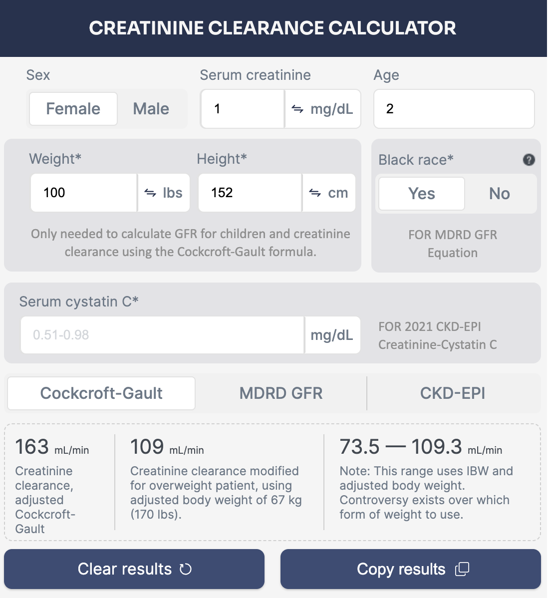
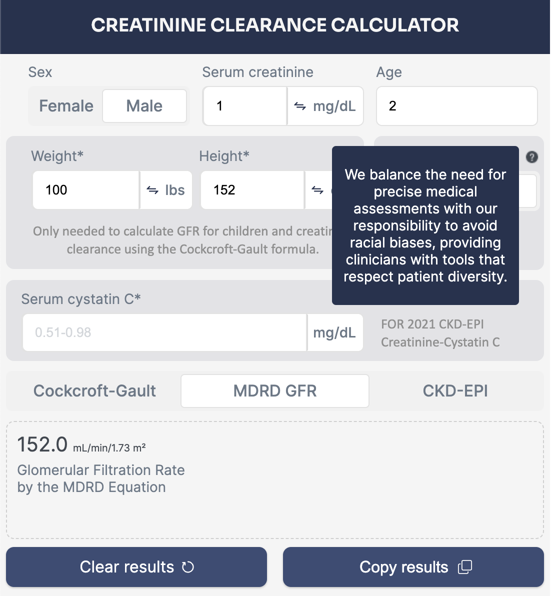
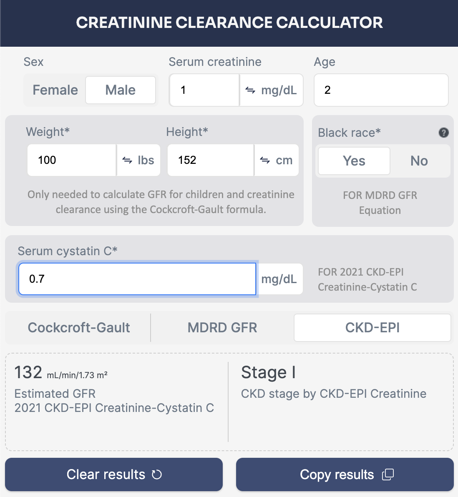

# Chrome Extension: Creatinine Calculator

This Chrome extension provides a convenient calculator for estimating creatinine clearance using three different equations: Cockcroft-Gault Equation, MDRD GFR Equation, and 2021 CKD-EPI Creatinine-Cystatin C equation. 

## Features
- **Cockcroft-Gault Equation**: Estimates creatinine clearance based on serum creatinine, age, weight, and gender.
- **MDRD GFR Equation**: Estimates glomerular filtration rate (GFR) based on serum creatinine, age, race, and gender.
- **2021 CKD-EPI Creatinine-Cystatin C**: Calculates GFR using both serum creatinine and cystatin C levels.

## Disclaimer
This extension is intended for educational purposes and should not be used as a substitute for professional medical advice. Always consult a healthcare provider for accurate assessment and interpretation of renal function.

## Acknowledgments
- [Cockcroft-Gault Equation](https://en.wikipedia.org/wiki/Glomerular_filtration_rate#Cockcroft-Gault_formula)
- [MDRD GFR Equation](https://en.wikipedia.org/wiki/Glomerular_filtration_rate#Modification_of_Diet_in_Renal_Disease_(MDRD)_formula)
- [CKD-EPI Creatinine-Cystatin C](https://en.wikipedia.org/wiki/Glomerular_filtration_rate#CKD-EPI_formula)

## Links:
- [Github](https://github.com/EloWeld/CreatineCalculatorExtension)

# Screenshots

