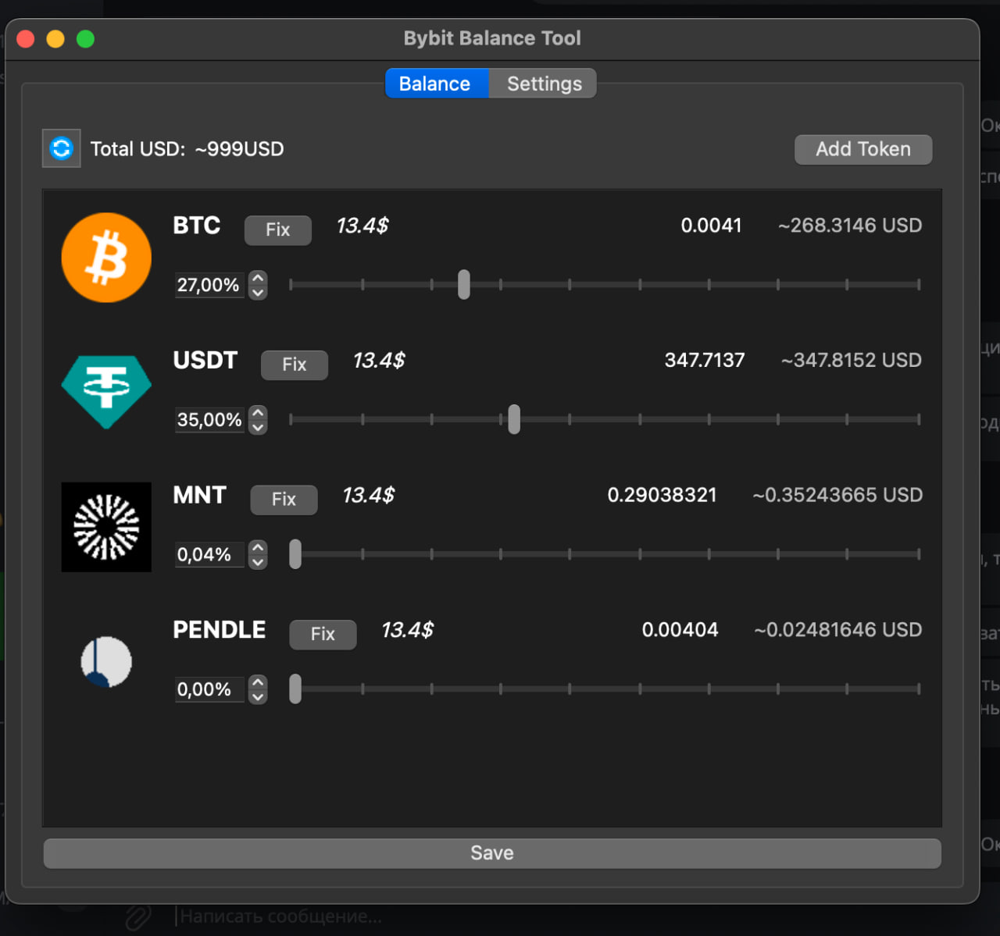
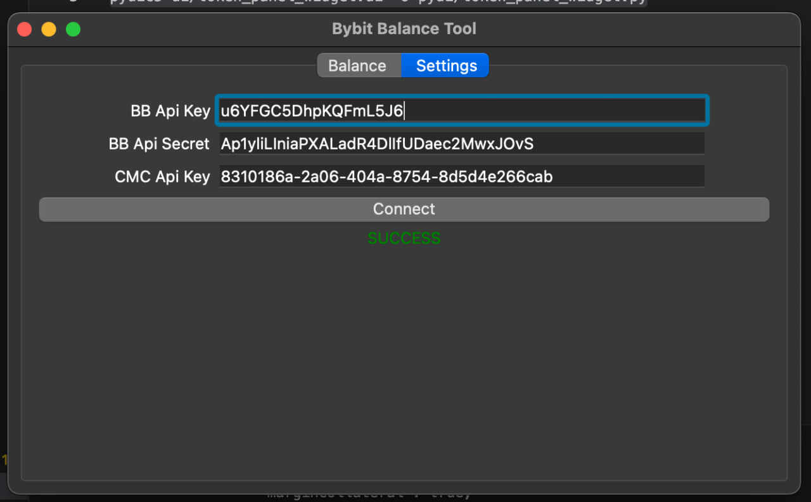
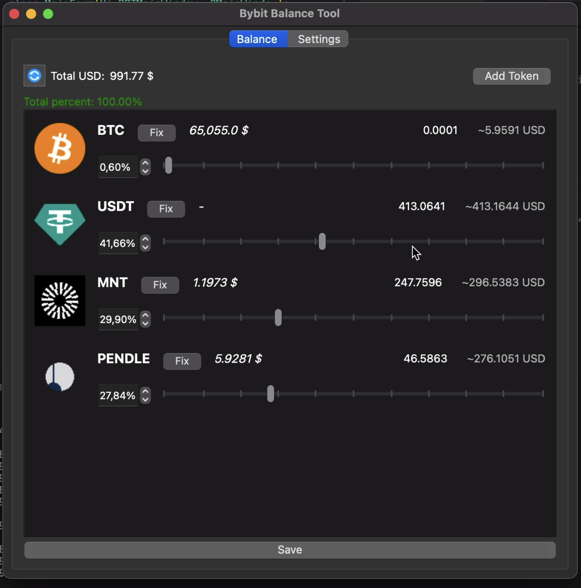

# Bybit Balance Tool

Project is aimed at automating the process of rebalancing an investment portfolio on a cryptocurrency exchange. 

## Functionalities

1. **API and Secret Key Input Window**: To connect to the cryptocurrency exchange, users must input their API and Secret keys, granting access to trading data and operations on the exchange. (All API Keys on scheenshots already disabled)

2. **Percentage Setting Window for Rebalancing**: Users can set a percentage at which a rebalancing operation will be triggered. This enables automatic detection and correction of deviations in asset distribution.

3. **In future**: In future we will add button "Add tokens", and you will be able to add new tokens for your Bybit portfolio and maybe I'll make more smoothness design

## Integration with Bybit and CoinMarketCap

Integration with the Bybit cryptocurrency exchange has already been implemented to realize the program's functionality. Users can manage their portfolio and perform trading operations on this exchange through the program interface.

Additionally, to enhance the user experience, a connection to the CoinMarketCap API has been added. This allows the program to fetch token icons, making the interface more user-friendly.

## Screenshots

